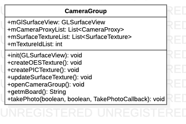

# CameraGroup源码解析

> 封装多个摄像头代理类，供SuperView等外部类使用

**CameraGroup类图**



## 代码解析

#### 构造函数

```java
public CameraGroup(@Board String board) {
    mBoard = board;
    switch (mBoard) {
        case Board.BOARD_8953:
            mCameraProxyList = new ArrayList<>(Arrays.asList(
                new CameraProxy(0)
            ));
            break;
        case Board.BOARD_T7:
            mCameraProxyList = new ArrayList<>(Arrays.asList(
                    new CameraProxy(CameraView.BACK),
                    new CameraProxy(CameraView.FRONT),
                    new CameraProxy(CameraView.LEFT),
                    new CameraProxy(CameraView.RIGHT)
            ));
            break;
    }
}
```

#### 创建OES纹理

```java
void createOESTexture() {
    Log.d(TAG, "createOESTexture.");
    switch (mBoard) {
        case Board.BOARD_8953:
            mTextureIdList = new int[] {
                    GLES20Util.getOESTexture(GLES20.GL_TEXTURE0)
            };//8953纹理Id
            break;
        case Board.BOARD_T7:
            mTextureIdList = new int[] {
                    GLES20Util.getOESTexture(GLES20.GL_TEXTURE1),//Back
                    GLES20Util.getOESTexture(GLES20.GL_TEXTURE2),//Front
                    GLES20Util.getOESTexture(GLES20.GL_TEXTURE3),//Left
                    GLES20Util.getOESTexture(GLES20.GL_TEXTURE4)//Right
            };//T7纹理Id
            break;
    }
    mSurfaceTextureList = new ArrayList<>();
    for (int id : mTextureIdList) {
        mSurfaceTextureList.add(new SurfaceTexture(id));
    }
    for (int i = 0; i < mCameraProxyList.size(); i++) {
        mSurfaceTextureList.get(i).setOnFrameAvailableListener(new SurfaceTexture.OnFrameAvailableListener() {
            @Override
            public void onFrameAvailable(SurfaceTexture surfaceTexture) {
                mCameraReady++;
                if(mCameraReady == mCameraProxyList.size()) {
                    mCameraReady = 0;
                    mGlSurfaceView.requestRender();
                }
            }
        });
    mCameraProxyList.get(i).setPreviewTexture(mSurfaceTextureList.get(i));
    }
}
```

#### 创建PIC纹理

```java
void createPICTexture() {
    mSurfaceTextureList = new ArrayList<>(Arrays.asList(
            new SurfaceTexture(GLES20Util.getPICTexture(mGlSurfaceView.getContext(), PIC_BACK, GLES20.GL_TEXTURE1)),
            new SurfaceTexture(GLES20Util.getPICTexture(mGlSurfaceView.getContext(), PIC_FRONT, GLES20.GL_TEXTURE2)),
            new SurfaceTexture(GLES20Util.getPICTexture(mGlSurfaceView.getContext(), PIC_LEFT, GLES20.GL_TEXTURE3)),
            new SurfaceTexture(GLES20Util.getPICTexture(mGlSurfaceView.getContext(), PIC_RIGHT, GLES20.GL_TEXTURE4))
    ));

    for (SurfaceTexture surfaceTexture : mSurfaceTextureList) {
        surfaceTexture.setOnFrameAvailableListener(new SurfaceTexture.OnFrameAvailableListener() {
            @Override
            public void onFrameAvailable(SurfaceTexture surfaceTexture) {
                mGlSurfaceView.requestRender();
            }
        });
    }
}
```

#### 更新纹理

```java
void updateSurfaceTexture() {
    for (SurfaceTexture surfaceTexture : mSurfaceTextureList) {
        if (surfaceTexture != null) {
            surfaceTexture.updateTexImage();
        }
    }
}
```

#### 打开摄像头

```java
public void openCameraGroup() {
    for (CameraProxy cameraProxy : mCameraProxyList) {
        if (mBoard.equals(Board.BOARD_T7)) {
            if (!cameraProxy.openCameraT7()) {
                Log.d(TAG, "openCameraGroup: failed.");
            }
        } else {
            if (!cameraProxy.openCamera8953()) {
                Log.d(TAG, "openCameraGroup: failed.");
            }
        }
    }
}
```

#### 拍摄照片

```java
public void takePhoto(boolean isSaveSdcaed, boolean isToast, CameraProxy.TakePhotoCallback callback) {
    if (isToast) {
        ToastUtil.showShortToast(R.string.str_wait);
    }
    if (mBoard.equals(Board.BOARD_T7)) {
        for (int i = 0; i < mCameraProxyList.size(); i++) {
            mCameraProxyList.get(i).takePhoto(isSaveSdcaed,
                    i == mCameraProxyList.size() - 1 ? callback : null);
        }
    } else {
        mCameraProxyList.get(0).take8953Photo(isSaveSdcaed, callback);
    }
}
```