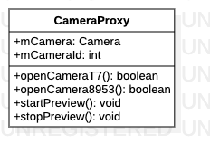

# CameraProxy源码解析

> 封装Android原生的camera类

**CameraProxy类图**



## 代码解析

#### 初始化

```java
public CameraProxy(int cameraId) {
    mCameraId = cameraId;
    //设置摄像头分辨率
    CAMERA_8953_WIDTH = 1280;
    CAMERA_8953_HEIGHT = 720;
}
```

#### 打开T7摄像头

```java
public boolean openCameraT7() {
    Log.d(TAG, "openCamera cameraId: " + mCameraId);
    try {
        if (mCameraId != INVALID_CAMERA_ID) {
            mCamera = Camera.open(mCameraId);
            Camera.Parameters parms = mCamera.getParameters();
            parms.setPreviewSize(CAMERA_T7_WIDTH, CAMERA_T7_HEIGHT);
            parms.setPictureSize(CAMERA_T7_WIDTH, CAMERA_T7_HEIGHT);
            parms.setPictureFormat(ImageFormat.JPEG);
            //图片质量
            parms.setJpegQuality(100);
            mCamera.setParameters(parms);
        }
    } catch (Exception e) {
        e.printStackTrace();
        return false;
    }
    return true;
}
```

#### 打开8953摄像头

```java
public boolean openCamera8953() {
    try {
        mCamera = Camera.open(mCameraId);
    }
    catch (Exception e){
        Log.e(TAG, "Camera is not available (in use or does not exist): " + e.getLocalizedMessage());
        return false;
    }
    mCamera.setParameters(mCamera.getParameters());
    return true;
}
```

#### 开始预览

```java
public void startPreview() {
    if (mCamera != null) {
        mCamera.startPreview();
    }
}
```

#### 停止预览

```java
public void stopPreview() {
    if (mCamera != null) {
        mCamera.stopPreview();
    }
}
```

#### T7拍照

```java
public void takePhoto(boolean isSaveSdcard, TakePhotoCallback callback) {
    if (mCamera == null) return;
    this.isSaveSdcard = isSaveSdcard;
    this.callback = callback;
    mCamera.autoFocus((success, camera) -> {
        mCamera.takePicture(null, null, mPicture);
    });
}
```

#### 8953拍照

```java
public void take8953Photo(boolean isSaveSdcard, TakePhotoCallback callback) {
    if (mCamera == null) return;
    isSaved = true;
    this.isSaveSdcard = isSaveSdcard;
    this.callback = callback;
    mCamera.setPreviewCallback(mPreviewCallback);
}
```

#### 获取T7相机标定顺序

```java
private int getT7CalibeanIndex(int cameraID) {
    switch (cameraID) {
        case AnnotationMacro.CameraView.BACK:
            return CAMERA_BACK;
        case AnnotationMacro.CameraView.FRONT:
            return CAMERA_FRONT;
        case AnnotationMacro.CameraView.LEFT:
            return CAMERA_LEFT;
        case AnnotationMacro.CameraView.RIGHT:
            return CAMERA_RIGHT;
    }
    return CAMERA_FRONT;
}
```

#### 获取8953相机标定顺序

```java
private int get8953CalibeanIndex(int select) {
    switch (select) {
        case 0:
            return CAMERA_BACK;
        case 1:
            return CAMERA_LEFT;
        case 2:
            return CAMERA_RIGHT;
        case 3:
            return CAMERA_FRONT;
    }
    return CAMERA_FRONT;
}
```