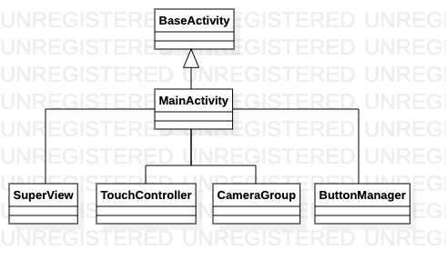
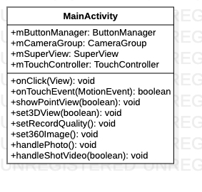

# MainActivity源码解析

> 应用主活动，继承BaseActivity，包含窗口渲染，摄像头控制，触摸控制和按键控制。

**MainActivity类关系图**



**MainActivity类图**



## 代码解析

#### 静态成员变量

```java
public static @Board String mBoard = Board.BOARD_T7;//硬件类型
public static @OnDrawFrameMode int frameMode = OnDrawFrameMode.MAIN;//渲染视图模式
```

#### 状态栏按钮控制

```java
@Override
public void onClick(View v) {
    switch (v.getId()) {
        case R.id.iv_back://返回按钮
            set3DView(false);
            break;
        case R.id.iv_3d://3D环视按钮
            set3DView(true);
            break;
        case R.id.iv_photo://拍照按钮
            handlePhoto();
            break;
        case R.id.iv_video://录像按钮
            handleShotVideo(!SuperView.mRequestRecord);
            break;
        case R.id.iv_setting://设置按钮
            llStatusBar.setVisibility(View.GONE);
            mButtonManager.setButtonView(false, false);
            SettingMainFragment.go(getSupportFragmentManager(), null);
            break;
    }
}
```

#### 渲染模式触屏控制

```java
@Override
public boolean onTouchEvent(MotionEvent event) {
    switch (frameMode) {
        case OnDrawFrameMode.BASIC:
        case OnDrawFrameMode.CALIBRATION:
        case OnDrawFrameMode.CARMODEL:
        case OnDrawFrameMode.PROJECT:
        case OnDrawFrameMode.SIDEVIEW:
        case OnDrawFrameMode.BLACKVIEW:
        case OnDrawFrameMode.FOURCAMERAVIEW:
        case OnDrawFrameMode.MANUALCALIBRATIONVIEW:
        case OnDrawFrameMode.MEDIAPLAYERVIEW:
            break;
        case OnDrawFrameMode.MAIN:
            mTouchController.clickEvent(event, mButtonManager);
            break;
        case OnDrawFrameMode.SURROUNDVIEW:
            mTouchController.rotationEvent(event);
            break;
        case OnDrawFrameMode.BACKCAMERAVIEW:
        case OnDrawFrameMode.FRONTCAMERAVIEW:
        case OnDrawFrameMode.LEFTCAMERAVIEW:
        case OnDrawFrameMode.RIGHTCAMERAVIEW:
            mTouchController.onTouchEventCameraCalibration(event);
            break;
    }
    return super.onTouchEvent(event);
}
```

#### 视频录制

```java
private void handleShotVideo(boolean isStart) {
    if (isStart) {
        //TODO  打开录像
        if (!SettingUtil.isUsbVailible()) return;
        setRecordQuality();
      	mSuperView.setCameraRecorderOutputFile(SettingUtil.getVieoOutPath());
        start = new Date().getTime();
        SuperView.mRequestRecord = true;
        showPointView(true);
        ToastUtil.showShortToast(R.string.start_video);
    } else {
        //TODO 关闭录像
        SuperView.mRequestRecord = false;
        showPointView(false);
        ToastUtil.showShortToast(R.string.stop_video);
    }
}
```

#### 获取录像质量

```java
private void setRecordQuality() {
    String recordQuality = ConfigUtils.getConfigBean().getGetmRecordQuality();
    switch (recordQuality) {
        case "全高清":
            mSuperView.setQuality(mSuperView.UHD);
            break;
        case "高清":
            mSuperView.setQuality(mSuperView.HD);
            break;
        case "标清":
            mSuperView.setQuality(mSuperView.SD);
            break;
    }
}
```

#### 开始拍照

```java
private void handlePhoto() {
    if (!SettingUtil.isUsbVailible() || !FileUtil.hasEnoughSpaceForWrite(false)) return;
    mCameraGroup.takePhoto(false, true, isSuccess -> {
        ToastUtil.showShortToast(Utils.getString(R.string.take_photo_success));
    });
}
```

#### 设置视图

```java
public void showPointView(boolean isShow) {
    llVideoTime.setVisibility(isShow ? View.VISIBLE : View.GONE);
    if (isShow) {
        handler.post(runnable);
    } else {
        handler.removeCallbacks(runnable);
    }
}
```

#### 更换背景图片

```java
private void set360Image() {
    String picPath = ConfigUtils.getConfigBean().getMPicPath();
    Glide.with(this).load(TextUtils.isEmpty(picPath) || !FileUtil.fileIsExist(picPath) ? R.drawable.selector_navi_home_bottom_360 : Uri.fromFile(new File(picPath))).fitCenter().into(m360ImageView);
}
```

