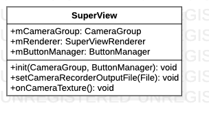
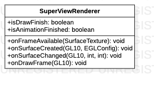

# SuperView源码解析

> 渲染视图，接受摄像头数据流，初始化Jni

**SuperView类关系图**


**SuperView类图**



## 代码解析

#### 静态成员变量

```java
public static @TextureMode String mTextureMode = TextureMode.OES;
```

#### 初始化

```java
public void init(CameraGroup cameraGroup, ButtonManager buttonManager) {
    mButtonManager = buttonManager;
    mCameraGroup = cameraGroup;
    mRenderer = new SuperViewRenderer();
    setEGLContextClientVersion(2);
    if (mCameraGroup.getmBoard().equals(Board.BOARD_T7)) {//初始化T7板子EGL环境
        setEGLContextFactory(new ContextFactory());
        setEGLConfigChooser(new ConfigChooser());
    } else {//初始化8953板子EGL环境
        setEGLContextFactory(new ContextFactory8953());
        setEGLConfigChooser(new ConfigChooser8953());
    }
    setRenderer(mRenderer);
    setPreserveEGLContextOnPause(true);
    mCameraGroup.openCameraGroup();
    mRecordEncoder = new CameraRecordEncoder();
}
```

#### 内部类SuperViewRenderer



> OPENGLES环境，Jni渲染需要在此处初始化

* onSurfaceCreated

```java
@Override
public void onSurfaceCreated(GL10 gl, EGLConfig config) {
    Log.d(TAG, "onSurfaceCreated.");
    mTextureID = GlUtil.createExternalTextureObject();
    mSurfaceTexture = new SurfaceTexture(mTextureID);
    String config_filename;
    if (mCameraGroup.getmBoard().equals(Board.BOARD_T7)) {
        config_filename = "/storage/emulated/0/Android/data/com.byd.aftermarketsvm/files/config/aftermarket.json";
    } else {
        config_filename = "/storage/emulated/0/Android/data/com.byd.aftermarketsvm/files/config/byd.json";
    }
    //获取当前车型
    int carModle = ConfigUtils.getConfigBean().getMCarModelType();
    Log.e(TAG, "onSurfaceCreated: " + mCameraGroup.getmBoard());
    NativeLibrary.init(config_filename, mTextureMode, mCameraGroup.getmBoard(), carModle);
    new CarModleAsync().execute();
    if (mTextureMode.equals(TextureMode.OES)) {
        mCameraGroup.createOESTexture();
    } else {
        mCameraGroup.createPICTexture();
    }
    recording = mRecordEncoder.isRecording();
    SettingUtil.initNativeData();
}
```

* onSurfaceChanged

```java
@Override
public void onSurfaceChanged(GL10 gl, int width, int height) {
    Log.d(TAG, "onSurfaceChanged.");
    if (isOnMediaPlayer) {
        mMediaPlayerController.onSurfaceChanged(width, height);
    } else {
        NativeLibrary.onSurfaceChange(width, height);
    }
}
```

* onDrawFrame

```java
@Override
public void onDrawFrame(GL10 gl) {
    mCameraGroup.updateSurfaceTexture();
    if (ConfigUtils.getConfigBean().getMWakeupRotate()) {
        if (isAnimationFinished) {
            NativeLibrary.onDrawFrame();
        } else {
            isAnimationFinished = NativeLibrary.startAnimation();
            if (isAnimationFinished) {
                ((Activity) mContext).runOnUiThread(() -> {
                    mButtonManager.setButtonView(true, true);
                    if (ConfigUtils.getConfigBean().getMDefaultRear()) {
                        NativeLibrary.setDisplayMode(AnnotationMacro.DisplayMode.MODE2D);
                        NativeLibrary.setSingleCameraView(CameraView.BACK);
                    } else {
                        NativeLibrary.setDisplayMode(AnnotationMacro.DisplayMode.MODE2D);
                        NativeLibrary.setSingleCameraView(CameraView.FRONT);
                    }
                    NativeLibrary.setImageCalibration(false);
                    isDrawFinish = true;
                });
            }
        }
    } else {
        if (!isDrawFinish) {
            ((Activity) mContext).runOnUiThread(() -> {
                mButtonManager.setButtonView(true, true);
            });
            isDrawFinish = true;
            isAnimationFinished = true;
        }
        NativeLibrary.onDrawFrame();
    }
    drawCameraRecorderFrame();
    onCameraTexture();
}
```

* onFrameAvailable

```java
@Override
public void onFrameAvailable(SurfaceTexture surfaceTexture) {
    Log.d(TAG, "onFrameAvailable.");
    requestRender();
}
```

#### 内部类CarModelAsync


* doInbackground

```java
@Override
protected Void doInBackground(Void... voids) {
    //todo 车模初始化
    CachePreferences.saveModelState(false);
    boolean status = NativeLibrary.loadOtherCars();
    Log.d(TAG, "doInBackground: " + status);
    if (status) {
        Log.d(TAG, "doInBackground: queueEvent");
        queueEvent(NativeLibrary::setupCarModelMeshes);
    }
    return null;
}
```

* onPostExecute

```java
@Override
protected void onPostExecute(Void aVoid) {
    super.onPostExecute(aVoid);
    CachePreferences.saveModelState(true);
    EventBus.getDefault().post(CAR_MODEL_FINISH);
}
```

#### FPS显示

```java
public void onCameraTexture() {
    if (FragmentListManager.getInstance().isManualCalib()) return;
    // FPS
    frameCounter++;
    if(frameCounter >= 30) {
        final int fps = (int) (frameCounter * 1e9 / (System.nanoTime() - lastNanoTime));
        if(mFpsText != null) {
            Runnable fpsUpdater = new Runnable() {
                @SuppressLint("SetTextI18n")
                public void run() {
                    mFpsText.setText("FPS: " + fps);

                    mFpsText.setTextColor(Color.RED);
                }
            };
            new Handler(Looper.getMainLooper()).post(fpsUpdater);
        } else {
            Log.e(TAG, "mFpsText == null");
            mFpsText = ((Activity)getContext()).findViewById(R.id.tv_fps);
        }
        frameCounter = 0;
        lastNanoTime = System.nanoTime();
    }
}
```

