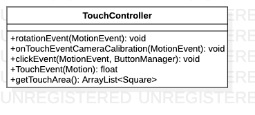
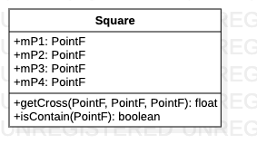

# TouchController源码解析

> 负责应用的触摸控制

**TouchController类图**



## 代码解析

#### 旋转事件

```java
public void rotationEvent(MotionEvent event) {
    float[] point = TouchEvent(event);
    NativeLibrary.onTouchEvent(-point[0], point[1], point[2],point[5], point[6]);
}
```

#### 相机标定触摸事件

```java
public void onTouchEventCameraCalibration(MotionEvent event) {
    float[] point = TouchEvent(event);
    NativeLibrary.onTouchEventCameraCalibration(point[0], -point[1]);
}
```

#### 点击事件

```java
public void clickEvent(MotionEvent event, ButtonManager manager) {
    if (event.getAction() == MotionEvent.ACTION_DOWN) {
        float[] point = TouchEvent(event);
        PointF touchPoint = new PointF(point[3], point[4]);
        ArrayList<Square> touchAreas = getTouchArea();
        for (int i = 0; i < touchAreas.size(); i++) {
            if (touchAreas.get(i).isContain(touchPoint)) {
                switch (i) {
                    case 0:
                        manager.mLeftBtn.performClick();
                        break;
                    case 1:
                        manager.mFrontBtn.performClick();
                        break;
                    case 2:
                        manager.mBackBtn.performClick();
                        break;
                    case 3:
                        manager.mRightBtn.performClick();
                        break;
                    case 4:
                        break;
                }
            }
        }
    }
}
```

#### 触摸事件

```java
private float[] TouchEvent(MotionEvent motionEvent){
    switch (motionEvent.getActionMasked()) {
        case MotionEvent.ACTION_UP:
        case MotionEvent.ACTION_CANCEL:
        case MotionEvent.ACTION_POINTER_UP:
        case MotionEvent.ACTION_HOVER_EXIT:
        case MotionEvent.ACTION_OUTSIDE:
            if (lastActionTime > SystemClock.uptimeMillis() - 250) {
            } else {
                gestureChanged = true;
                touchDelay = 0;
                lastActionTime = SystemClock.uptimeMillis();
            }
            break;
        case MotionEvent.ACTION_DOWN:
        case MotionEvent.ACTION_POINTER_DOWN:
        case MotionEvent.ACTION_HOVER_ENTER:
            Log.d(TAG, "Gesture changed...");
            gestureChanged = true;
            touchDelay = 0;
            lastActionTime = SystemClock.uptimeMillis();
            break;
        case MotionEvent.ACTION_MOVE:
            touchDelay++;
            break;
        default:
            Log.w(TAG, "Unknown state: " + motionEvent.getAction());
            gestureChanged = true;
    }

    int pointerCount = motionEvent.getPointerCount();

    if (pointerCount == 1) {
        x1 = motionEvent.getX();
        y1 = motionEvent.getY();
        if (gestureChanged) {
            Log.d(TAG, "x:" + x1 + ",y:" + y1);
            previousX1 = x1;
            previousY1 = y1;
        }
        dx1 = x1 - previousX1;
        dy1 = y1 - previousY1;

        if (gestureChanged && touchDelay > 1) {
            gestureChanged = false;
            Log.v(TAG, "Fin");
        }
        //大于0是顺时针，小于0是逆时针
        clockwise = (previousX1 - mCenter[0]) * (y1 - mCenter[1]) - (previousY1 - mCenter[1]) * (x1 - mCenter[0]);
        zoom = 0;
        previousX1 = x1;
        previousY1 = y1;
    }

    if (pointerCount == 2) {
        x1 = motionEvent.getX(0);
        y1 = motionEvent.getY(0);
        x2 = motionEvent.getX(1);
        y2 = motionEvent.getY(1);
        // Log.d(TAG, "x1:" + x1 + ",y1:" + y1 + ",x2:" + x2 + ",y2:" + y2);
        if (gestureChanged) {
            previousX1 = x1;
            previousY1 = y1;
            previousX2 = x2;
            previousY2 = y2;
            System.arraycopy(vector, 0, previousVector, 0, vector.length);
        }
        dx1 = x1 - previousX1;
        dy1 = y1 - previousY1;
        dx2 = x2 - previousX2;
        dy2 = y2 - previousY2;

        previousLength = (float) Math
                .sqrt(Math.pow(previousX2 - previousX1, 2) + Math.pow(previousY2 - previousY1, 2));
        length = (float) Math.sqrt(Math.pow(x2 - x1, 2) + Math.pow(y2 - y1, 2));


        // gesture detection
        isOneFixedAndOneMoving = ((dx1 + dy1) == 0) != (((dx2 + dy2) == 0));
        fingersAreClosing = !isOneFixedAndOneMoving && (Math.abs(dx1 + dx2) < 10 && Math.abs(dy1 + dy2) < 10);
        if (fingersAreClosing) {
            clockwise = 0;
            zoom = (length - previousLength) /900 ;
            Log.i(TAG, "Zooming '" + zoom+ "'...");

        }
        if (gestureChanged && touchDelay > 1) {
            gestureChanged = false;
            Log.v(TAG, "Fin");
        }

        previousX1 = x1;
        previousY1 = y1;
        previousX2 = x2;
        previousY2 = y2;
    }

    return new float[]{dx1,dy1, clockwise, x1, y1,pointerCount, zoom};
}
```

#### 获取触摸区域

```java
private ArrayList<Square> getTouchArea() {
    ArrayList<Square> mTouchAreas = new ArrayList<>(5);

    int height = 600;
    int width = 318;

    float[] carSize = {1800.0f, 4660.0f};
    float[] viewSize = {7500.0f, 12500.0f};

    float widthRatio = carSize[0]/viewSize[0];
    float heightRatio = carSize[1]/viewSize[1];

    //bird view area
    PointF b1 = new PointF(0,0);
    PointF b2 = new PointF(width,0);
    PointF b3 = new PointF(width,height);
    PointF b4 = new PointF(0,height);
    //car area
    PointF c1 = new PointF(width*(1 - widthRatio)/2,height*(1 - heightRatio)/2);
    PointF c2 = new PointF(width*(1 + widthRatio)/2,height*(1 - heightRatio)/2);
    PointF c3 = new PointF(width*(1 + widthRatio)/2,height*(1 + heightRatio)/2);
    PointF c4 = new PointF(width*(1 - widthRatio)/2,height*(1 + heightRatio)/2);

    mTouchAreas.add(new Square(b1,c1,c4,b4));  //left
    mTouchAreas.add(new Square(b1,c1,c2,b2));  //front
    mTouchAreas.add(new Square(b4,c4,c3,b3));  //back
    mTouchAreas.add(new Square(b2,c2,c3,b3));  //right
    mTouchAreas.add(new Square(c1,c2,c3,c4));  //car

    return mTouchAreas;
}
```

#### 内部类Square

**Square类图**：

