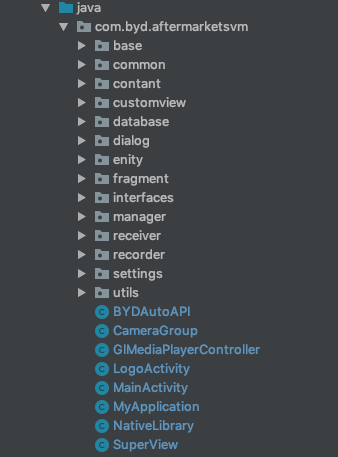

# Android端代码

**交接人**：段元甫

> Android端代码大部分由杨瑞泽重构过，我这里着重说明下他没有动过的代码

这是整个Android端代码的结构

**当前目录**：src/main/java/com.byd.aftermarket/

| 文件名称             | 路径      | 功能         |
| -------------------- | --------- | ------------ |
| MainActivity.java    | ./        | 主活动       |
| SuperView.java       | ./        | GL渲染核心   |
| NativeLibrary.java   | ./        | Jni接口文件  |
| CameraGroup.java     | ./        | 镜头组实体类 |
| AnnotationMacro.java | ./common/ | 注释宏       |
| CameraProxy.java     | ./common/ | 相机代理类   |
| TouchController.java | ./common/ | 触摸控制器   |
| CalibrationBean.java | ./enity/  | 标定数据存储 |
| AssetsUtil.java      | ./utils/  | assets工具   |
| GLES20Util.java      | ./utils/  | GLES20工具   |

