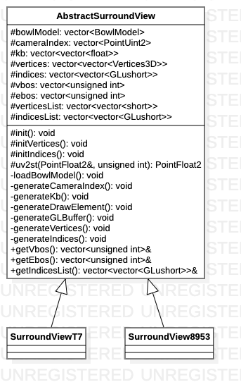

# AbstractSurrundView类

> SurroundView父类

**类图**



## 代码解析

#### 初始化

```c++
void AbstractSurroundView::init() {
    loadBowlModel();
    generateCameraIndex();
    generateKb();
    initVertices();
    initIndices();
    generateDrawElement();
}
```

#### 加载碗状模型

```c++
void AbstractSurroundView::loadBowlModel() {
    for (const std::string& cameraOrder : SingletonConfig::getCameraOrder()) {
        bowlModel.push_back(SvmUtils::LoadBowlModel(
          ((std::string)FOLDER_RESOURCE+FOLDER_OBJ+cameraOrder2Obj(cameraOrder)).c_str()));
    }
    for (const std::string& fusionOrder : SingletonConfig::getFusionOrder()) {
        bowlModel.push_back(SvmUtils::LoadBowlModel(
          ((std::string)FOLDER_RESOURCE+FOLDER_OBJ+fusionOrder2Obj(fusionOrder)).c_str()));
    }
}
```

#### 相机索引生成

```c++
void AbstractSurroundView::generateCameraIndex() {
    this->cameraIndex = std::vector<PointUint2> {
        PointUint2(0, 0), PointUint2(1, 0), PointUint2(2, 0), PointUint2(3, 0)
    };
    for (std::string fusionOrder : SingletonConfig::getFusionOrder()) {
        this->cameraIndex.push_back(fusionOrder2PointUint2(fusionOrder));
    }
}
```

#### Kb系数生成

```c++
void AbstractSurroundView::generateKb() {
    for (std::string fusionOrder : SingletonConfig::getFusionOrder()) {
        this->kb.push_back(fusionOrder2Kb(fusionOrder));
    }
}
```

#### GLBuffer生成

```c++
void AbstractSurroundView::generateGLBuffer(std::vector<short> &vertices, std::vector<GLushort> &indices, unsigned int &VBO, unsigned int &EBO) {
    // create the vbo for vertices
    glGenBuffers(1, &VBO);
    glBindBuffer(GL_ARRAY_BUFFER, VBO);
    glBufferData(GL_ARRAY_BUFFER, vertices.size() * sizeof(short), &vertices[0], GL_STATIC_DRAW);
    //create the ibo for vertices
    glGenBuffers(1, &EBO);
    glBindBuffer(GL_ELEMENT_ARRAY_BUFFER, EBO);
    glBufferData(GL_ELEMENT_ARRAY_BUFFER, indices.size() * sizeof(GLushort), &indices[0], GL_STATIC_DRAW);
    //unbind
    glBindBuffer(GL_ARRAY_BUFFER, 0);
    glBindBuffer(GL_ELEMENT_ARRAY_BUFFER, 0);
}
```

#### 顶点数据生成

```c++
void AbstractSurroundView::generateVertices(std::vector<short> &vertices, unsigned int index) {
    for (auto &i : this->vertices[index]) {
        vertices.push_back(static_cast<short >(i.wld_pose.x*1000));
        vertices.push_back(static_cast<short >(i.wld_pose.y*1000));
        vertices.push_back(static_cast<short >(i.wld_pose.z*1000));
        vertices.push_back(static_cast<short >(i.st1.x*1000));
        vertices.push_back(static_cast<short >(i.st1.y*1000));
        vertices.push_back(static_cast<short >(i.st2.x*1000));
        vertices.push_back(static_cast<short >(i.st2.y*1000));
        vertices.push_back(static_cast<short >(i.weight*1000));
        vertices.push_back(static_cast<short >(i.index*1000));
    }
}
```

#### 索引数据生成

```c++
void AbstractSurroundView::generateIndices(std::vector<GLushort> &indices, unsigned int index) {
    for (GLushort & i : this->indices[index]) {
        indices.push_back(static_cast<GLushort>(i));
    }
}
```

#### 绘制元素生成

```c++
void AbstractSurroundView::generateDrawElement() {
    for (unsigned int i = 0; i < AREAS_NUM; i++) {
        std::vector<short > vertices;
        std::vector<GLushort> indices;
        generateVertices(vertices, i);
        generateIndices(indices, i);
        this->verticesList.push_back(vertices);
        this->indicesList.push_back(indices);
        unsigned int VBO;
        unsigned int EBO;
        generateGLBuffer(vertices, indices, VBO, EBO);
        this->vbos.push_back(VBO);
        this->ebos.push_back(EBO);
    }
}
```

#### 顶点数据初始化

```c++
void AbstractSurroundView::initVertices() {
    float ratio = SingletonConfig::getRatio();
    std::vector<int> bowlSize = SingletonConfig::getBowlSize();
    for (unsigned int i = 0; i < AREAS_NUM; i++) {
        std::vector<Vertice3D> vertices;
        for (unsigned int j = 0; j < bowlModel[i].V.size(); j++) {
            PointFloat3 worldCoord = PointFloat3(bowlModel[i].V[j].x * BOWL_RATE_X, bowlModel[i].V[j].y * BOWL_RATE_Y, (bowlModel[i].V[j].z + bowlSize[2] * 0.5f));
            Vertice3D vertice;
            vertice.wld_pose = PointFloat3(worldCoord.x * 2.0f * ratio / bowlSize[0], worldCoord.y * 2.0f * ratio / bowlSize[1], worldCoord.z * 2.0f * ratio / bowlSize[0]);
            CameraParameter cameraParameter1;
            cameraParameter1.intrinsicParameter = SingletonParam::getIntrinsicParam()[cameraIndex[i].x];
            cameraParameter1.extrinsicParameter = SingletonParam::getExtrinsicParam()[cameraIndex[i].x];
            PointFloat2 imageCoord = SvmUtils::World2Image(worldCoord, cameraParameter1);
            vertice.st1 = uv2st(imageCoord, cameraIndex[i].x);
            if (i > 3) {
                CameraParameter cameraParameter2;
                cameraParameter2.intrinsicParameter = SingletonParam::getIntrinsicParam()[cameraIndex[i].y];
                cameraParameter2.extrinsicParameter = SingletonParam::getExtrinsicParam()[cameraIndex[i].y];
                imageCoord = SvmUtils::World2Image(worldCoord, cameraParameter2);
                vertice.st2 = uv2st(imageCoord, cameraIndex[i].y);
                //cal weight
                float a1, a2;
                float aa = worldCoord.x * this->kb[i - 4][0] + this->kb[i - 4][1];
                float bb = worldCoord.x * this->kb[i - 4][2] + this->kb[i - 4][3];
                if (i == 4 || i == 7) {
                    if (aa < worldCoord.y) {
                        if (bb > worldCoord.y) {
                            a1 = static_cast<float>(abs(aa - worldCoord.y) / sqrt(pow(this->kb[i - 4][0], 2) + 1));
                            a2 = static_cast<float>(abs(bb - worldCoord.y) / sqrt(pow(this->kb[i - 4][2], 2) + 1));
                        } else {
                            a1 = 1.0f;
                            a2 = 0.0f;
                        }
                    } else {
                        a1 = 0.0f;
                        a2 = 1.0f;
                    }
                } else {
                    if (aa > worldCoord.y) {
                        if (bb < worldCoord.y) {
                            a1 = static_cast<float>(abs(aa - worldCoord.y) / sqrt(pow(this->kb[i - 4][0], 2) + 1));
                            a2 = static_cast<float>(abs(bb - worldCoord.y) / sqrt(pow(this->kb[i - 4][2], 2) + 1));
                        } else {
                            a1 = 1.0f;
                            a2 = 0.0f;
                        }
                    } else {
                        a1 = 0.0f;
                        a2 = 1.0f;
                    }
                }
                vertice.weight = a2 * 1.0f / (a1 + a2);
            } else {
                vertice.st2 = PointFloat2(-1.0f, -1.0f);
                vertice.weight = 1.0f;
            }
            vertice.index = static_cast<int>(i * 1.0f);
            vertices.push_back(vertice);
        }
        this->vertices.push_back(vertices);
        SvmUtils::ClearVector(vertices);
    }
}
```

#### 索引数据初始化

```c++
void AbstractSurroundView::initIndices() {
    for (auto &i : bowlModel) {
        std::vector<GLushort > indices;
        for (auto &j : i.F) {
            for (GLushort k : j) {
                indices.push_back(k);
            }
        }
        this->indices.push_back(indices);
        SvmUtils::ClearVector(indices);
    }
}
```

#### T7纹理坐标转换

```c++
PointFloat2 SurroundViewT7::uv2st(const PointFloat2 &imageCoord, unsigned int index) {
    std::vector<float> imageSize = SingletonConfig::getImageSize();
    return PointFloat2(imageCoord.x / imageSize[0], imageCoord.y / imageSize[1]);
}
```

#### 8953纹理坐标转换

```c++
PointFloat2 SurroundView8953::uv2st(const PointFloat2 &imageCoord, unsigned int index) {
    PointFloat2 st;
    std::vector<float> image_size = SingletonConfig::getImageSize();
    if (index == 0) {
        st.x = imageCoord.x / image_size[0] * 0.25f;
        st.y = imageCoord.y / image_size[1] * 1.0f;
    } else if (index == 1) {
        st.x = imageCoord.x / image_size[0] * 0.25f + 0.25f;
        st.y = imageCoord.y / image_size[1] * 1.0f;
    } else if (index == 2) {
        st.x = imageCoord.x / image_size[0] * 0.25f + 0.5f;
        st.y = imageCoord.y / image_size[1] * 1.0f;
    } else if (index == 3) {
        st.x = imageCoord.x / image_size[0] * 0.25f + 0.75f;
        st.y = imageCoord.y / image_size[1] * 1.0f;
    } else {
        LOGD("Invalid camera index.");
        exit(1);
    }
    return st;
}
```