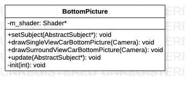

# BottomPicture类

> 车模底部方框

**类图**



## 代码解析

#### 构造函数

```c++
BottomPicture(int carType) {
    m_shader = Factory::createShader(SHADER_SINGLECIEW_CAR_BOTTOM_VERTEX, SHADER_SINGLECIEW_CAR_BOTTOM_FRAGMENT);
    init(carType);
}
```

#### 初始化

```c++
void BottomPicture::init(int carType) {
    m_view_size = SingletonConfig::getViewSize();
    m_3dbowlsize = SingletonConfig::getBowlSize();
    m_ratio = SingletonConfig::getRatio();
    m_tangle_size = SingletonConfig::getTangleSize();

    GenerateVertices(m_SingleViewCarBottomPictureVertices);
    GenerateIndices(m_SingleViewCarBottomPictureIndices);

    glGenBuffers(1, &m_SingleViewCarBottomPictureVBO);
    glBindBuffer(GL_ARRAY_BUFFER, m_SingleViewCarBottomPictureVBO);
    glBufferData(GL_ARRAY_BUFFER, m_SingleViewCarBottomPictureVertices.size() * sizeof(float), &m_SingleViewCarBottomPictureVertices[0], GL_STATIC_DRAW);

    //create the ibo for vertices
    glGenBuffers(1, &m_SingleViewCarBottomPictureEBO);
    glBindBuffer(GL_ELEMENT_ARRAY_BUFFER, m_SingleViewCarBottomPictureEBO);
    glBufferData(GL_ELEMENT_ARRAY_BUFFER, m_SingleViewCarBottomPictureIndices.size() * sizeof(GLushort), &m_SingleViewCarBottomPictureIndices[0], GL_STATIC_DRAW);

    //unbind
    glBindBuffer(GL_ARRAY_BUFFER, 0);
    glBindBuffer(GL_ELEMENT_ARRAY_BUFFER, 0);
}
```

#### 绘制单视图车底图片

```c++
void BottomPicture::drawSingleViewCarBottomPicture(Camera camera) {
    glm::mat4 trans = glm::mat4(1.0f);
     glDisable(GL_DEPTH_TEST);
    UpdateVBO();
    m_shader->use();
    m_shader ->setMat4("trans", trans);
    glm::mat4 projection = glm::perspective(glm::radians(camera.Zoom), mPerspectRatio, 0.1f, 100.0f);
    m_shader->setMat4("projection", projection);
    glm::mat4 view = camera.GetViewMatrix();
    m_shader->setMat4("view", view);
    m_shader->setVec2("scale", m_scaleParams);
    m_shader->setFloat("offset", m_offset);
    aPositionLocation = glGetAttribLocation(m_shader->ID, POSITION_ATTRIBUTE);
    glEnableVertexAttribArray(aPositionLocation);
    glBindBuffer(GL_ARRAY_BUFFER, m_SingleViewCarBottomPictureVBO);
    glVertexAttribPointer(aPositionLocation, 2, GL_FLOAT, GL_FALSE,  2*sizeof(float), (const GLvoid*) 0);
    glBindBuffer(GL_ELEMENT_ARRAY_BUFFER, m_SingleViewCarBottomPictureEBO);
    glDrawElements(GL_TRIANGLES, static_cast<GLsizei>(m_SingleViewCarBottomPictureIndices.size()), GL_UNSIGNED_SHORT, 0);
    glBindBuffer(GL_ARRAY_BUFFER, 0);
    glBindBuffer(GL_ELEMENT_ARRAY_BUFFER, 0);
    glDisableVertexAttribArray(aPositionLocation);
    glEnable(GL_DEPTH_TEST);
}
```

#### 绘制环视图车底图片

```c++
void BottomPicture::drawSurroundViewCarBottomPicture(Camera cameraBird) {
    glm::mat4 trans = glm::mat4(1.0f);
    glDisable(GL_DEPTH_TEST);
    UpdateVBO();
    m_shader->use();
    m_shader->setMat4("trans", trans);
    glm::mat4 projection = glm::perspective(glm::radians(cameraBird.Zoom), m_view_size[0] / m_view_size[1], 0.1f, 100.0f);
    m_shader->setMat4("projection", projection);
    glm::mat4 view = cameraBird.GetViewMatrix();
    m_shader->setMat4("view", view);
    m_shader->setVec2("scale", m_scaleParams);
    m_shader->setFloat("offset", m_offset);
    m_shader->setFloat("scaleY", screenRatio);
    aPositionLocation = glGetAttribLocation(m_shader->ID, POSITION_ATTRIBUTE);
    glEnableVertexAttribArray(aPositionLocation);
    glBindBuffer(GL_ARRAY_BUFFER, m_SingleViewCarBottomPictureVBO);
    glVertexAttribPointer(aPositionLocation, 2, GL_FLOAT, GL_FALSE,  2*sizeof(float), (const GLvoid*) 0);
    glBindBuffer(GL_ELEMENT_ARRAY_BUFFER, m_SingleViewCarBottomPictureEBO);
    glDrawElements(GL_TRIANGLES, static_cast<GLsizei>(m_SingleViewCarBottomPictureIndices.size()), GL_UNSIGNED_SHORT, 0);
    glBindBuffer(GL_ARRAY_BUFFER, 0);
    glBindBuffer(GL_ELEMENT_ARRAY_BUFFER, 0);
    glDisableVertexAttribArray(aPositionLocation);
    glEnable(GL_DEPTH_TEST);
}
```

#### 更新数据

```c++
void update(AbstractSubject* subject) {
    m_blind_params = subject->getBlindZoneParams();
    LOGD("m_blind_params: %f, %f, %f", m_blind_params.front, m_blind_params.back, m_blind_params.side);
    CalBlindParams(subject->getBlindZoneParams());
    mCarParams = subject->getCarParams();
    mCarType = subject->getCarType();
    mBlackAreaRatio = subject->getBlackRatio();
}
```

