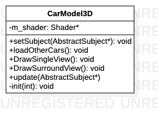

# CarModel3D类

> 车模绘制类

**类图**



## 代码解析

#### 构造函数

```c++
CarModel3D(int carType) {
    m_shader = Factory::createShader(SHADER_CAR_MODEL_3D_VERTEX, SHADER_CAR_MODEL_3D_FRAGMENT);
    init(carType);
}
```

#### 初始化

```c++
void CarModel3D::init(int carType){
    m_view_size = SingletonConfig::getViewSize();
    m_svm_area_size = SingletonConfig::getBowlSize();
    m_ratio = SingletonConfig::getRatio();
    if(carType==0){
        createSedanObj();
        setSedanMesh();
        equalSedanObj();
        m_car_params = sedan_params;
        m_sedanModel = glm::scale(glm::mat4(1.0), glm::vec3(sedan_params.model_ratio_h / float(m_svm_area_size[0]), sedan_params.model_ratio_w / float(m_svm_area_size[1]), sedan_params.model_ratio_h / float(m_svm_area_size[0])));
        m_model = glm::translate(m_sedanModel, glm::vec3(-0.2f, 0.0, 0.0));
        carType0 = true;
        mCarType = 0;
    } else if(carType==1){
        createHatchObj();
        setHatchMesh();
        equalHatchObj();
        m_car_params = hatchCar_params;
        m_hatchModel = glm::scale(glm::mat4(1.0), glm::vec3(hatchCar_params.model_ratio_h / float(m_svm_area_size[0]), hatchCar_params.model_ratio_w / float(m_svm_area_size[1]), hatchCar_params.model_ratio_h / float(m_svm_area_size[0])));
        m_model = glm::translate(m_hatchModel, glm::vec3(-1.7f, 0.0, 0.0));
        carType1 = true;
        mCarType = 1;
    }else{
        createSuvObj();
        setSuvMesh();
        equalSuvObj();
        m_car_params = SUV_params;
        m_suvModel = glm::scale(glm::mat4(1.0), glm::vec3(SUV_params.model_ratio_h / float(m_svm_area_size[0]), SUV_params.model_ratio_w / float(m_svm_area_size[1]), SUV_params.model_ratio_h / float(m_svm_area_size[0])));
        m_model = glm::translate(m_suvModel, glm::vec3(-0.8f, 0.0, 0.0));
        carType2 = true;
        mCarType = 2;
    }
}
```

#### 加载其他车模

```c++
bool CarModel3D::loadOtherCars(){
    if(!carType0){
        createSedanObj();
    }
    if(!carType1){
        createHatchObj();
    }
    if(!carType2){
        createSuvObj();
    }
    return true;
}
```

#### 绘制环视视图

```c++
void CarModel3D::DrawSurroundView(Camera camera, int screenWidth, int screenHeight, int rearLightLeft, int rearLightRight) {
    glDisable(GL_BLEND);
    glEnable(GL_DEPTH_TEST);
    m_projection = glm::perspective(glm::radians(camera.Zoom), m_view_size[0] / m_view_size[1], 0.1f, 100.0f);
    m_view = camera.GetViewMatrix();
    m_viewPos = camera.Position;
    m_trans = m_projection * m_view;
    m_shader->use();
    m_shader->setVec3("viewPos", m_viewPos);
    m_shader->setMat4("transform", m_trans);
    m_shader->setFloat("scaleY", screenRatio);
    m_rearLightLeft = rearLightLeft;
    m_rearLightRight = rearLightRight;
    renderCarObj();
}
```

#### 绘制单视图

```c++
void CarModel3D::DrawSingleView(Camera camera, int screenWidth, int screenHeight, int rearLightLeft, int rearLightRight) {
    glDisable(GL_BLEND);
    glEnable(GL_DEPTH_TEST);
    m_projection = glm::perspective(glm::radians(camera.Zoom), float(screenWidth)/screenHeight, 0.1f, 100.0f);
    m_view = camera.GetViewMatrix();
    m_viewPos = camera.Position;
    m_trans = m_projection * m_view;
    m_shader->use();
    m_shader->setVec3("viewPos", m_viewPos);
    m_shader->setMat4("transform", m_trans);
    m_shader->setFloat("scaleY", 1.0);
    m_rearLightLeft = rearLightLeft;
    m_rearLightRight = rearLightRight;
    renderCarObj();
}
```

#### 数据更新

```c++
void update(AbstractSubject* subject) {
    m_blind_params = subject->getBlindZoneParams();
    CalBlindParams(subject->getBlindZoneParams());
    mCarParams = subject->getCarParams();
    mCar_l = subject->getCarParams().car_length;
    mCar_w = subject->getCarParams().car_width;
    mScaleX = mCar_l/mCarL0;
    mScaleY = mCar_w/mCarW0;
    mRed = subject->getRed();
    mGreen = subject->getGreen();
    mBlue = subject->getBlue();
    change_Kd = glm::vec3(subject->getRed(), subject->getGreen(), subject->getBlue());
    mCarModelBrightness = glm::vec3(1.0) + subject->getCarModelBrightness();
    mCarModelHighlight = subject->getCarModelHighlight();
    mCarModelHighlightRange = subject->getCarModelHighlightRange();
    switchCarModel(subject->getCarType());
    m_rearLeftLight = subject->getRearLeftLight();
    m_rearRightLight = subject->getRearRightLight();
    SetDoorAngle(subject->getDoorIndex(), subject->getDoorstatus());
}
```

