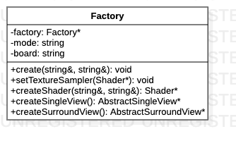

# Factory类

> 工厂类，做成单例模式，提供全局访问点。可以创建Shader, SingleView和SurroundView。

**类图**



## 代码解析

#### 创建工厂

```c++
void Factory::create(const std::string &mode, const std::string &board) {
    if (factory == nullptr) {
        factory = new Factory(mode, board);
    } else {
        LOGD("Factory has been created.");
    }
}
```

#### 创建着色器

```c++
Shader* Factory::createShader(const std::string& vertexPath, const std::string& fragmentPath) {
    std::string path = "/storage/emulated/0/Android/data/com.byd.aftermarketsvm/files/shader/OES/";
    std::string vertex = path + vertexPath;
    std::string fragment = path + fragmentPath;
    return new Shader(vertex.c_str(), fragment.c_str());
}
```

#### 创建SingleView

```c++
AbstractSingleView *Factory::createSingleView() {
    if (factory->getBoard() == "T7") {
        return new SingleViewT7();
    } else {
        return new SingleView8953();
    }
}
```

#### 创建SurroundView

```c++
AbstractSurroundView *Factory::createSurroundView() {
    if (factory->getBoard() == "T7") {
        return new SurroundViewT7();
    } else {
        return new SurroundView8953();
    }
}
```

#### 设置纹理采样器

```c++
void Factory::setTextureSampler(Shader *shader) {
    if (factory->getBoard() == "T7") {
        shader->setInt(TEXTURE_SAMPLER_UNIFORM_BACK, 1);
        shader->setInt(TEXTURE_SAMPLER_UNIFORM_FRONT, 2);
        shader->setInt(TEXTURE_SAMPLER_UNIFORM_LEFT, 3);
        shader->setInt(TEXTURE_SAMPLER_UNIFORM_RIGHT, 4);
        shader->setFloat("boardType", 0.0);
    } else {
        shader->setInt(TEXTURE_SAMPLER_UNIFORM, 0);
        shader->setFloat("boardType", 1.0);
    }
}
```