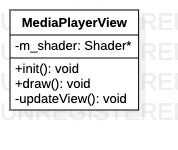

# MediaPlayerView类

> 多媒体视图类

**类图**



## 代码解析

#### 构造函数

```c++
MediaPlayerView::MediaPlayerView() {
    std::string shaderFolder = "/storage/emulated/0/Android/data/com.byd.aftermarketsvm/files/shader/am/";
    std::string vert_filename = shaderFolder + SHADER_MEDIA_PLAYER_VERTEX;
    std::string frag_filename = shaderFolder + SHADER_MEDIA_PLAYER_FRAGMENT;
    m_shader = new Shader(vert_filename.c_str(), frag_filename.c_str());
}
```

#### 初始化

```c++
void MediaPlayerView::init() {
    LOGD(" MediaPlayerView init.");
    generateVertices(m_vertices, DEVISION);
    generateIndices(m_indices, DEVISION);
    glGenBuffers(1, &m_VBO);
    glBindBuffer(GL_ARRAY_BUFFER, m_VBO);
    glBufferData(GL_ARRAY_BUFFER, m_vertices.size() * sizeof(float), &m_vertices[0], GL_STATIC_DRAW);
    //create the ibo for vertices
    glGenBuffers(1, &m_EBO);
    glBindBuffer(GL_ELEMENT_ARRAY_BUFFER, m_EBO);
    glBufferData(GL_ELEMENT_ARRAY_BUFFER, m_indices.size() * sizeof(GLushort), &m_indices[0], GL_STATIC_DRAW);
    //unbind
    glBindBuffer(GL_ARRAY_BUFFER, 0);
    glBindBuffer(GL_ELEMENT_ARRAY_BUFFER, 0);
}
```

#### 绘制视图

```c++
void MediaPlayerView::draw() {
    glClearColor(0.1, 0.1, 0.1, 1.0f);
    glClear(GL_DEPTH_BUFFER_BIT | GL_COLOR_BUFFER_BIT);
    glViewport(0, 0, m_screenWidth, m_screenHeight);
    glScissor(0, 0, m_screenWidth, m_screenHeight);
    m_shader->use();
    m_shader->setInt(TEXTURE_SAMPLER_UNIFORM, 6);
    updateView();
}
```

#### 更新视图

```c++
void MediaPlayerView::updateView() {
    aPositionLocation = glGetAttribLocation(m_shader->ID, POSITION_ATTRIBUTE);
    aTextureCoordLocation = glGetAttribLocation(m_shader->ID, TEXTURE_COORD_ATTRIBUTE);
    glEnableVertexAttribArray(aPositionLocation);
    glEnableVertexAttribArray(aTextureCoordLocation);
    glBindBuffer(GL_ARRAY_BUFFER, m_VBO);
    glVertexAttribPointer(aPositionLocation, 2, GL_FLOAT, GL_FALSE, STRIDE, (const GLvoid*) 0);
    glVertexAttribPointer(aTextureCoordLocation, 2, GL_FLOAT, GL_FALSE, STRIDE, (const GLvoid*) (2 * sizeof(float)));
    glBindBuffer(GL_ELEMENT_ARRAY_BUFFER, m_EBO);
    glDrawElements(GL_TRIANGLES, static_cast<GLsizei>(m_indices.size()), GL_UNSIGNED_SHORT, 0);
    glBindBuffer(GL_ARRAY_BUFFER, 0);
    glBindBuffer(GL_ELEMENT_ARRAY_BUFFER, 0);
    glDisableVertexAttribArray(aPositionLocation);
    glDisableVertexAttribArray(aTextureCoordLocation);
}
```

