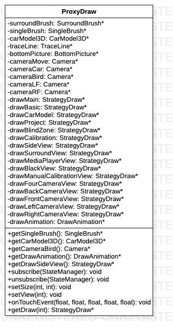

# ProxyDraw类

> 绘制工具代理类，集中处理各种组件和绘图行为。

**类图**



## 代码解析

#### 绘图组件

```c++
private:
    SurroundBrush *surroundBrush = nullptr;//环视图绘图刷
    SingleBrush *singleBrush = nullptr;//单视图绘图刷
    CarModel3D *carModel3D = nullptr;//3D模型
    TraceLine *traceLine = nullptr;//轨迹线
    BottomPicture *bottomPicture = nullptr;//车底图片
```

#### 绘图行为

```c++
StrategyDraw *drawMain = nullptr;//绘制主视图
StrategyDraw *drawBasic = nullptr;//绘制基本设置
StrategyDraw *drawCarModel = nullptr;//绘制车模设置
StrategyDraw *drawProject = nullptr;//绘制工程设置
StrategyDraw *drawBlindZone = nullptr;//绘制盲区设置
StrategyDraw *drawCalibration = nullptr;//绘制校正设置
StrategyDraw *drawSideView = nullptr;//绘制测试图设置
StrategyDraw *drawSurroundView = nullptr;//绘制环视
StrategyDraw *drawMediaPlayerView = nullptr;//绘制多媒体视图
StrategyDraw *drawBlackView = nullptr;//绘制黑屏
StrategyDraw *drawManualCalibrationView = nullptr;//绘制手动标定视图
StrategyDraw *drawFourCameraView = nullptr;//绘制4相机视图（校准镜头）
StrategyDraw *drawBackCameraView = nullptr;//绘制后相机视图（校准镜头）
StrategyDraw *drawFrontCameraView = nullptr;//绘制前相机视图（校准镜头）
StrategyDraw *drawLeftCameraView = nullptr;//绘制左相机视图（校准镜头）
StrategyDraw *drawRightCameraView = nullptr;//绘制右相机视图（校准镜头）
DrawAnimation *drawAnimation = nullptr;//绘制环视动画
```

#### 订阅状态管理器

```c++
void ProxyDraw::subscribe(StateManager *manager) {
    surroundBrush->setSubject(manager);
    singleBrush->setSubject(manager);
    carModel3D->setSubject(manager);
    traceLine->setSubject(manager);
    bottomPicture->setSubject(manager);
}
```

#### 取消订阅状态管理器

```c++
void ProxyDraw::unsubscribe(StateManager *manager) {
    manager->detach(surroundBrush);
    manager->detach(singleBrush);
    manager->detach(carModel3D);
    manager->detach(traceLine);
    manager->detach(bottomPicture);
}
```

#### 选择绘图行为

```c++
StrategyDraw *ProxyDraw::getDraw(int mode) {
    singleBrush->setMode(static_cast<OnDrawFrameMode>(mode));
    if (mode != 2) {
        cameraMove->SetViewMode(int(VIEW_AROUND));
    }
    switch (mode) {
        case 0://MAIN
            return drawMain;
        case 1://BASIC
            return drawBasic;
        case 2://CARMODEL
            return drawCarModel;
        case 3://PROJECT
            return drawProject;
        case 4://CALIBRATION
            return drawCalibration;
        case 5://SIDEVIEW
            return drawSideView;
        case 6://SURROUNDVIEW
            return drawSurroundView;
        case 7://MEDIAPLAYERVIEW
            return drawMediaPlayerView;
        case 8://BLACKVIEW
            return drawBlackView;
        case 9://MANUALCALIBRATIONVIEW
            return drawManualCalibrationView;
        case 10://FOURCAMERAVIEW
            return drawFourCameraView;
        case 11://BACKCAMERAVIEW
            return drawBackCameraView;
        case 12://FRONTCAMERAVIEW
            return drawFrontCameraView;
        case 13://LEFTCAMERAVIEW
            return drawLeftCameraView;
        case 14://RIGHTCAMERAVIEW
            return drawRightCameraView;
        case 15://BLINDZONE
            return drawBlindZone;
        default:
            return drawMain;
    }
}
```

#### 触摸事件

```c++
void ProxyDraw::onTouchEvent(float x, float y, float clockWise, float point, float scale) {
    if (point == 1.0 ) {
        cameraMove->MoveInSphere(x, y, clockWise);
    }
    if (point == 2.0) {
        cameraMove->ProcessZoom(scale);
    }
}
```

