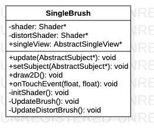

# SingleBrush类

> 单视图绘制类

**类图**



## 代码解析

#### 构造函数

```c++
SingleBrush::SingleBrush() {
    this->shader = Factory::createShader(SHADER_SINGLE_VIEW_VERTEX, SHADER_SINGLE_VIEW_FRAGMENT);
    this->distortShader = Factory::createShader(SHADER_SINGLE_VIEW_DISTORT_VERTEX, SHADER_SINGLE_VIEW_FRAGMENT);
    this->singleView = Factory::createSingleView();
    initShader();
}
```

#### 初始化着色器

```c++
void SingleBrush::initShader() {
    shader->use();
    Factory::setTextureSampler(shader);
    distortShader->use();
    Factory::setTextureSampler(distortShader);
}
```

#### 数据更新

```c++
void SingleBrush::update(AbstractSubject *subject) {
    mSideViewCameraIndex = subject->getSideViewCameraIndex();
    int index = subject->getSideViewCameraIndex();
    mDistortDisplayParams = subject->getDistortDisplayParams();
    m_distort_params[index].Xoffset = subject->getDistortDisplayParams().Xoffset;
    m_distort_params[index].Yoffset = subject->getDistortDisplayParams().Yoffset;
    m_distort_params[index].Xscale = subject->getDistortDisplayParams().Xscale;
    m_distort_params[index].Yscale = subject->getDistortDisplayParams().Yscale;
    m_distort_params[index].angle = subject->getDistortDisplayParams().angle;
    mUnDistortDisplayParams = subject->getUnDistortDisplayParams();
    m_undistort_params[index].scale = subject->getUnDistortDisplayParams().scale;
    m_undistort_params[index].angle = subject->getUnDistortDisplayParams().angle;
    mCalibrated = subject->isCalibrated();
    mVideoBrightness = 1.0 + subject->getVideoBrightness();
    mVideoContrast = 1.0 + subject->getVideoContrast();
    mVideoSaturation = 1.0 + subject->getVideoSaturation();
}
```

#### 绘制2D图像

```c++
void SingleBrush::draw2D(enum_camera_view camera_view) {
    if(mCalibrated) {
        UpdateBrush(camera_view);
    }else{
        UpdateDistortBrush(camera_view);
    }
}
```

#### 触摸事件

```c++
void SingleBrush::onTouchEvent(float x, float y) {
    switch (mode) {
        case MAIN:break;
        case BASIC:break;
        case CARMODEL:break;
        case PROJECT:break;
        case CALIBRATION:break;
        case SIDEVIEW:break;
        case SURROUNDVIEW:break;
        case MEDIAPLAYERVIEW:break;
        case BLACKVIEW:break;
        case MANUALCALIBRATIONVIEW:break;
        case FOURCAMERAVIEW:break;
        case BACKCAMERAVIEW:
            mBackOffset.x += x/width;
            mBackOffset.y += y/height;
            break;
        case FRONTCAMERAVIEW:
            mFrontOffset.x += x/width;
            mFrontOffset.y += y/height;
            break;
        case LEFTCAMERAVIEW:
            mLeftOffset.x += x/width;
            mLeftOffset.y += y/height;
            break;
        case RIGHTCAMERAVIEW:
            mRightOffset.x += x/width;
            mRightOffset.y += y/height;
            break;
    }
}
```

#### 更新无畸变绘图刷

```c++
void SingleBrush::UpdateBrush(enum_camera_view view) {
    float imageAxScale = 0.0f;
    float imageAyScale = 0.0f;
    glm::mat4 rotation = glm::mat4(1.0f);
    glm::vec4 displayParams;
    int camera_index;
    int index;
    switch (view) {
        case enum_camera_view::RIGHTFRONT:    // RIGHTFRONT
            index = 3;
            camera_index = SvmUtils::cameraOrderIndex("RIGHT");
            imageAxScale = m_imageViewOffset[0];
            imageAyScale = m_imageViewOffset[1];
            rotation = glm::rotate(rotation, glm::radians(m_undistort_params[index].angle), glm::vec3(0.0f, 0.0f, 1.0f));
            rotation = glm::rotate(rotation, glm::radians(-90.0f), glm::vec3(0.0, 0.0, 1.0));
            displayParams =  glm::vec4(0.0, 0.0, m_undistort_params[index].scale, m_undistort_params[index].scale);
            break;
        case enum_camera_view::LEFTBACK:
            index = 2;
            camera_index = SvmUtils::cameraOrderIndex("LEFT");
            imageAxScale = m_imageViewOffset[2];
            imageAyScale = m_imageViewOffset[1];
            rotation = glm::rotate(rotation, glm::radians(m_undistort_params[index].angle), glm::vec3(0.0f, 0.0f, 1.0f));
            rotation = glm::rotate(rotation, glm::radians(90.0f), glm::vec3(0.0, 0.0, 1.0));
            displayParams = glm::vec4(0.0, 0.0, m_undistort_params[index].scale, m_undistort_params[index].scale);
            break;
        case enum_camera_view::RIGHTBACK:
            index = 3;
            camera_index = SvmUtils::cameraOrderIndex("RIGHT");
            imageAxScale = -m_imageViewOffset[2];
            imageAyScale = m_imageViewOffset[1];
            rotation = glm::rotate(rotation, glm::radians(m_undistort_params[index].angle), glm::vec3(0.0f, 0.0f, 1.0f));
            rotation = glm::rotate(rotation, glm::radians(-90.0f), glm::vec3(0.0, 0.0, 1.0));
            displayParams = glm::vec4(0.0, 0.0, m_undistort_params[index].scale, m_undistort_params[index].scale);
            break;
        case enum_camera_view::LEFTFRONT:     //LEFTFRONT
            index = 2;
            camera_index = SvmUtils::cameraOrderIndex("LEFT");
            imageAxScale = -m_imageViewOffset[0];
            imageAyScale = m_imageViewOffset[1];
            rotation = glm::rotate(rotation, glm::radians(m_undistort_params[index].angle), glm::vec3(0.0f, 0.0f, 1.0f));
            rotation = glm::rotate(rotation, glm::radians(90.0f), glm::vec3(0.0, 0.0, 1.0));
            displayParams = glm::vec4(0.0, 0.0, m_undistort_params[index].scale, m_undistort_params[index].scale);
            break;
        case enum_camera_view::FRONT:
            index = 1;
            camera_index = SvmUtils::cameraOrderIndex("FRONT");
            rotation = glm::rotate(rotation, glm::radians(m_undistort_params[index].angle), glm::vec3(0.0f, 0.0f, 1.0f));
            displayParams = glm::vec4(0.0, 0.0, m_undistort_params[index].scale, m_undistort_params[index].scale);
            break;
        case enum_camera_view::BACK:
            index = 0;
            camera_index = SvmUtils::cameraOrderIndex("BACK");
            rotation = glm::rotate(rotation, glm::radians(m_undistort_params[index].angle), glm::vec3(0.0f, 0.0f, 1.0f));
            rotation = glm::rotate(rotation, glm::radians(180.0f), glm::vec3(0.0, 1.0, 0.0));
            displayParams = glm::vec4(0.0, 0.0, m_undistort_params[index].scale, m_undistort_params[index].scale);
            break;
        case enum_camera_view::LEFT:
            index = 2;
            camera_index = SvmUtils::cameraOrderIndex("LEFT");
            rotation = glm::rotate(rotation, glm::radians(m_undistort_params[index].angle), glm::vec3(0.0f, 0.0f, 1.0f));
            displayParams = glm::vec4(0.0, 0.0, m_undistort_params[index].scale, m_undistort_params[index].scale);
            break;
        case enum_camera_view::RIGHT:
            index = 3;
            camera_index = SvmUtils::cameraOrderIndex("RIGHT");
            rotation = glm::rotate(rotation, glm::radians(m_undistort_params[index].angle), glm::vec3(0.0f, 0.0f, 1.0f));
            displayParams = glm::vec4(0.0, 0.0, m_undistort_params[index].scale, m_undistort_params[index].scale);
            break;
        default:
            break;
    }
    shader->use();
    shader->setInt(CAMERA_UNIFORM, camera_index);
    shader->setFloat("imageAxViewScale", imageAxScale);
    shader->setFloat("imageAyViewScale", imageAyScale);
    glm::vec4 dist = glm::vec4(SingletonParam::getIntrinsicParam()[camera_index].coeff[0], SingletonParam::getIntrinsicParam()[camera_index].coeff[1], SingletonParam::getIntrinsicParam()[camera_index].coeff[2], SingletonParam::getIntrinsicParam()[camera_index].coeff[3]);
    shader ->setVec4("dist", dist);
    glm::vec4 intrinsic = glm::vec4(SingletonParam::getIntrinsicParam()[camera_index].xc, SingletonParam::getIntrinsicParam()[camera_index].yc, SingletonParam::getIntrinsicParam()[camera_index].fx, SingletonParam::getIntrinsicParam()[camera_index].fy);
    shader->setVec4("intrinsic", intrinsic);
    shader-> setVec2("image_size", SingletonConfig::getImageSize()[0], SingletonConfig::getImageSize()[1]);
    shader->setMat4("rotation", rotation);
    shader->setVec4("displayParams",displayParams );
    shader->setFloat("saturation", mVideoSaturation);
    shader->setFloat("contrast", mVideoContrast);
    shader->setFloat("brightness", mVideoBrightness);
    GLint aPositionLocation = glGetAttribLocation(shader->ID, POSITION_ATTRIBUTE);
    GLint aTextureCoordLocation = glGetAttribLocation(shader->ID, TEXTURE_COORD_ATTRIBUTE);
    glEnableVertexAttribArray(aPositionLocation);
    glEnableVertexAttribArray(aTextureCoordLocation);
    glBindBuffer(GL_ARRAY_BUFFER, singleView->getVbo());
    glVertexAttribPointer(aPositionLocation, 2, GL_FLOAT, GL_FALSE, STRIDE, (const GLvoid*) 0);
    glVertexAttribPointer(aTextureCoordLocation, 2, GL_FLOAT, GL_FALSE, STRIDE, (const GLvoid*) (2 * sizeof(float)));
    glBindBuffer(GL_ELEMENT_ARRAY_BUFFER, singleView->getEbo());
    glDrawElements(GL_TRIANGLES, static_cast<GLsizei>(singleView->getIndices().size()), GL_UNSIGNED_SHORT, 0);
    glBindBuffer(GL_ARRAY_BUFFER, 0);
    glBindBuffer(GL_ELEMENT_ARRAY_BUFFER, 0);
    glDisableVertexAttribArray(aPositionLocation);
    glDisableVertexAttribArray(aTextureCoordLocation);
}
```

#### 更新畸变绘图刷

```c++
void SingleBrush::UpdateDistortBrush(enum_camera_view view) {
    glm::vec4 imageParams = glm::vec4(0.0, 0.0, 1.0, 1.0);
    glm::vec4 displayParams;
    glm::mat4 rotation = glm::mat4(1.0f);
    int camera;
    int index;
    switch (view) {
        case enum_camera_view::RIGHTFRONT:    // RIGHTFRONT
            index = 3;
            imageParams = glm::vec4( -0.20, 0.02,0.49, 0.48);
            displayParams = glm::vec4(m_distort_params[index].Xoffset,m_distort_params[index].Yoffset,m_distort_params[index].Xscale,m_distort_params[index].Yscale);
            rotation = glm::rotate(rotation, glm::radians(m_distort_params[index].angle), glm::vec3(0.0f, 0.0f, 1.0f));
            camera = SvmUtils::cameraOrderIndex("RIGHT");
            break;
        case enum_camera_view::LEFTBACK:
            index = 2;
            imageParams = glm::vec4( -0.16, 0.01, 0.49, 0.48);
            displayParams = glm::vec4(m_distort_params[index].Xoffset,m_distort_params[index].Yoffset,m_distort_params[index].Xscale,m_distort_params[index].Yscale);
            rotation = glm::rotate(rotation, glm::radians(m_distort_params[index].angle), glm::vec3(0.0f, 0.0f, 1.0f));
            camera = SvmUtils::cameraOrderIndex("LEFT");
            break;
        case enum_camera_view::RIGHTBACK:
            index = 3;
            imageParams = glm::vec4(0.20, 0.02, 0.49, 0.48);
            displayParams = glm::vec4(m_distort_params[index].Xoffset,m_distort_params[index].Yoffset,m_distort_params[index].Xscale,m_distort_params[index].Yscale);
            rotation = glm::rotate(rotation, glm::radians(m_distort_params[index].angle), glm::vec3(0.0f, 0.0f, 1.0f));
            camera = SvmUtils::cameraOrderIndex("RIGHT");
            break;
        case enum_camera_view::LEFTFRONT:     //LEFTFRONT
            index = 2;
            imageParams = glm::vec4( 0.16, 0.01, 0.49, 0.48);
            displayParams = glm::vec4(m_distort_params[index].Xoffset,m_distort_params[index].Yoffset,m_distort_params[index].Xscale,m_distort_params[index].Yscale);
            rotation = glm::rotate(rotation, glm::radians(m_distort_params[index].angle), glm::vec3(0.0f, 0.0f, 1.0f));
            camera = SvmUtils::cameraOrderIndex("LEFT");
            break;
        case enum_camera_view::FRONT:
            index = 1;
            displayParams = glm::vec4(m_distort_params[index].Xoffset,m_distort_params[index].Yoffset,m_distort_params[index].Xscale,m_distort_params[index].Yscale);
            rotation = glm::rotate(rotation, glm::radians(m_distort_params[index].angle), glm::vec3(0.0f, 0.0f, 1.0f));
            camera = SvmUtils::cameraOrderIndex("FRONT");
            break;
        case enum_camera_view::BACK:
            index = 0;
            displayParams = glm::vec4(m_distort_params[index].Xoffset,m_distort_params[index].Yoffset,m_distort_params[index].Xscale,m_distort_params[index].Yscale);
            rotation = glm::rotate(rotation, glm::radians(180.0f), glm::vec3(0.0, 1.0, 0.0));
            rotation = glm::rotate(rotation, glm::radians(m_distort_params[index].angle), glm::vec3(0.0f, 0.0f, 1.0f));
            camera = SvmUtils::cameraOrderIndex("BACK");
            break;
        case enum_camera_view::LEFT:
            index = 2;
            displayParams = glm::vec4(m_distort_params[index].Xoffset,m_distort_params[index].Yoffset,m_distort_params[index].Xscale,m_distort_params[index].Yscale);
            rotation = glm::rotate(rotation, glm::radians(m_distort_params[index].angle), glm::vec3(0.0f, 0.0f, 1.0f));
            camera = SvmUtils::cameraOrderIndex("LEFT");
            break;
        case enum_camera_view::RIGHT:
            index = 3;
            displayParams = glm::vec4(m_distort_params[index].Xoffset,m_distort_params[index].Yoffset,m_distort_params[index].Xscale,m_distort_params[index].Yscale);
            rotation = glm::rotate(rotation, glm::radians(m_distort_params[index].angle), glm::vec3(0.0f, 0.0f, 1.0f));
            camera = SvmUtils::cameraOrderIndex("RIGHT");
            break;
        default:
            break;
    }
    distortShader->use();
    distortShader->setBool("uOriginalImageMode", mOriginalImageModel);
    distortShader->setInt(CAMERA_UNIFORM, camera);
    distortShader->setVec4("imageParams", imageParams);
    distortShader->setVec4("displayParams",displayParams );
    distortShader->setMat4("rotation", rotation);
    distortShader->setFloat("saturation", mVideoSaturation);
    distortShader->setFloat("contrast", mVideoContrast);
    distortShader->setFloat("brightness", mVideoBrightness);
    GLint aPositionLocation = glGetAttribLocation(distortShader->ID, POSITION_ATTRIBUTE);
    GLint aTextureCoordLocation = glGetAttribLocation(distortShader->ID, TEXTURE_COORD_ATTRIBUTE);
    glEnableVertexAttribArray(aPositionLocation);
    glEnableVertexAttribArray(aTextureCoordLocation);
    glBindBuffer(GL_ARRAY_BUFFER, singleView->getVbo());
    glVertexAttribPointer(aPositionLocation, 2, GL_FLOAT, GL_FALSE, STRIDE, (const GLvoid*) 0);
    glVertexAttribPointer(aTextureCoordLocation, 2, GL_FLOAT, GL_FALSE, STRIDE, (const GLvoid*) (2 * sizeof(float)));
    glBindBuffer(GL_ELEMENT_ARRAY_BUFFER, singleView->getEbo());
    glDrawElements(GL_TRIANGLES, static_cast<GLsizei>(singleView->getIndices().size()), GL_UNSIGNED_SHORT, 0);
    glBindBuffer(GL_ARRAY_BUFFER, 0);
    glBindBuffer(GL_ELEMENT_ARRAY_BUFFER, 0);
    glDisableVertexAttribArray(aPositionLocation);
    glDisableVertexAttribArray(aTextureCoordLocation);
}
```

