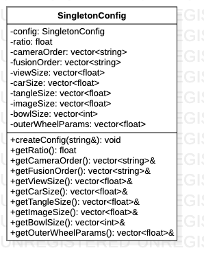

# SingletonConfig类

> 单例模式，提供json配置参数点全局访问点。

**类图**



## 代码解析

#### 私有构造函数

```c++
SingletonConfig::SingletonConfig(const std::string &file) {
    std::string jsonData = SvmUtils::ReadFile(file);
    rapidjson::Document doc;
    if(doc.Parse(jsonData.c_str()).HasParseError()){
        assert(0);
        LOGD(" read doc fail ");
    }

    this->ratio = SvmUtils::readFloat(doc, "fov_ratio");
    this->cameraOrder = SvmUtils::readStringVector(doc, "camera_order");
    this->fusionOrder = SvmUtils::readStringVector(doc, "fusion_order");
    this->viewSize = SvmUtils::readFloatVector(doc, "view_size");
    this->carSize = SvmUtils::readFloatVector(doc, "car_size");
    this->tangleSize = SvmUtils::readFloatVector(doc, "tangle_size");
    this->imageSize = SvmUtils::readFloatVector(doc, "image_size");
    this->bowlSize = SvmUtils::readIntVector(doc, "3d_bowl_size");
    this->outerWheelParams = SvmUtils::readFloatVector(doc, "outer_wheel_params");

    doc.GetAllocator().Clear();
    LOGD(" read config finish. %s", file.c_str());
}
```

#### 创建全局访问点

```c++
void SingletonConfig::createConfig(const std::string &file) {
    if (config == nullptr) {
        config = new SingletonConfig(file);
    } else {
        LOGD("Config has been created.");
    }
}
```

