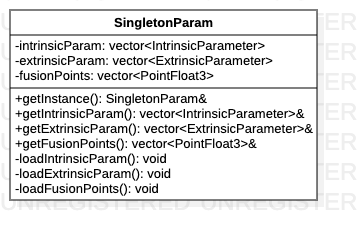

# SingletonParam类

> 单例模式，提供摄像机内外参数、融合系数大全局访问点。

**类图**



## 代码解析

#### 私有构造函数

```c++
SingletonParam::SingletonParam() {
    loadIntrinsicParam();
    loadExtrinsicParam();
    loadFusionPoints();
}
```

#### 获取全局访问点

```c++
SingletonParam &SingletonParam::getInstance() {
    static SingletonParam instance;
    return instance;
}
```

#### 加载摄像机内参

```c++
void SingletonParam::loadIntrinsicParam() {
    for (std::string orientation : SingletonConfig::getCameraOrder()) {
        SvmUtils::toLower(orientation);
        std::string fileName = (std::string)FOLDER_RESOURCE + FOLDER_CAMERA_PARAM + INTRINSIC + orientation + XML;
        intrinsicParam.push_back(SvmUtils::readIntrinsicParam(fileName));
    }
}
```

#### 加载摄像机外参

```c++
void SingletonParam::loadExtrinsicParam() {
    for (std::string orientation : SingletonConfig::getCameraOrder()) {
        SvmUtils::toLower(orientation);
        std::string fileName = (std::string)FOLDER_RESOURCE + FOLDER_CAMERA_PARAM + EXTRINSIC + orientation + XML;
        extrinsicParam.push_back(SvmUtils::readExtrinsicParam(fileName));
    }
}
```

#### 加载融合参数

```c++
void SingletonParam::loadFusionPoints() {//特定顺序
    std::ifstream fin((std::string)FOLDER_RESOURCE + FOLDER_CAMERA_PARAM + TXT_FUSION_POINTS);
    unsigned int points_size = 0;
    fin >> points_size;
    if(points_size != 16) {
        LOGD("points_size: %d", points_size);
    }
    PointFloat3 pose;
    for(unsigned int i=0; i < points_size; i++) {
        fin >> pose.x;
        fin >> pose.y;
        fin >> pose.z;
        fusionPoints.push_back(pose);
    }
    fin.close();
}
```