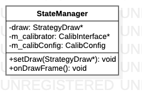

# StateManager类
> 状态管理器，管理渲染参数和标定接口。

**类图**



## 代码解析

#### 设置绘图行为

```c++
void StateManager::setDraw(StrategyDraw *draw) {
    StateManager::draw = draw;
}
```

#### 开始绘制

```c++
void StateManager::onDrawFrame() {
    draw->onDrawFrame();
}
```

