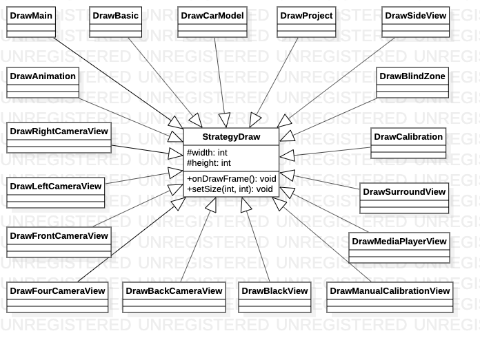

# StrategyDraw类

> 绘图行为父类，策略模式对绘图行为进行封装。

**关系图**

## 代码解析

> 封装onDrawFrame行为

| 绘图行为                  | 说明                       |
| ------------------------- | -------------------------- |
| DrawMain                  | 绘制主视图                 |
| DrawBasic                 | 绘制基本设置               |
| DrawCarModel              | 绘制车模设置               |
| DrawProject               | 绘制工程设置               |
| DrawBlindZone             | 绘制盲区设置               |
| DrawCalibration           | 绘制校正设置               |
| DrawSideView              | 绘制测试图设置             |
| DrawSurroundView          | 绘制环视                   |
| DrawMediaPlayerView       | 绘制多媒体视图             |
| DrawBlackView             | 绘制黑屏                   |
| DrawManualCalibrationView | 绘制手动标定视图           |
| DrawFourCameraView        | 绘制4相机视图（校准镜头）  |
| DrawBackCameraView        | 绘制后相机视图（校准镜头） |
| DrawFrontCameraView       | 绘制前相机视图（校准镜头   |
| DrawLeftCameraView        | 绘制左相机视图（校准镜头） |
| DrawRightCameraView       | 绘制右相机视图（校准镜头） |
| DrawAnimation             | 绘制环视动画               |

