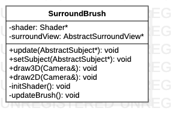

# SurroundBrush类

> 环视图绘制类

**类图**



## 代码解析

#### 构造函数

```c++
SurroundBrush::SurroundBrush() {
    this->shader = Factory::createShader(SHADER_SURROUND_VIEW_VERTEX, SHADER_SURROUND_VIEW_FRAGMENT);
    this->surroundView = Factory::createSurroundView();
    initShader();
}
```

#### 初始化着色器

```c++
void SurroundBrush::initShader() {
    //TODO: shader常量属性初始化
    shader->use();
    Factory::setTextureSampler(shader);
    shader->setInt("rearlight",REAR_LIGHT);
    shader->setFloat("lightlevel", LIGHT_LEVEL);
    shader->setFloat("gamma", GAMMA);
}
```

#### 3D效果绘制

```c++
void SurroundBrush::draw3D(Camera &camera) {
    m_trans = glm::rotate(glm::mat4(1.0f), (float)0.0f, glm::vec3(0.0f, 0.0f, 1.0f));
    m_projection = glm::perspective(glm::radians(camera.Zoom), mPerspectRatio, 0.1f, 100.0f);
    m_view = camera.GetViewMatrix();
    scaleY = 1.0;
    updateBrush();
}
```

#### 2D效果绘制

```c++
void SurroundBrush::draw2D(Camera &camera) {
    std::vector<float> viewSize = SingletonConfig::getViewSize();
    m_trans = glm::mat4(1.0f);
    m_projection = glm::perspective(glm::radians(45.0f), viewSize[0] / viewSize[1], 0.1f, 100.0f);
    m_view = camera.GetViewMatrix();
    scaleY = screenRatio;
    updateBrush();
}
```

#### 数据更新

```c++
void SurroundBrush::update(AbstractSubject *subject) {
    mVideoBrightness = 1.0 + subject->getVideoBrightness();
    mVideoContrast = 1.0 + subject->getVideoContrast();
    mVideoSaturation = 1.0 + subject->getVideoSaturation();
}
```

#### 更新绘图刷

```c++
void SurroundBrush::updateBrush() {
    shader->use();
    shader->setMat4("transform", m_trans);
    shader->setMat4("projection", m_projection);
    shader->setMat4("view", m_view);
    shader->setFloat("scaleY", scaleY);
    shader->setFloat("saturation", mVideoSaturation);
    shader->setFloat("contrast", mVideoContrast);
    shader->setFloat("brightness", mVideoBrightness);
    GLuint locationPosition = glGetAttribLocation(shader->ID, POSITION_ATTRIBUTE);
    GLuint locationCoord1 = glGetAttribLocation(shader->ID, TEXTURE_COORD1_ATTRIBUTE);
    GLuint locationCoord2 = glGetAttribLocation(shader->ID, TEXTURE_COORD2_ATTRIBUTE);
    GLuint locationWeight = glGetAttribLocation(shader->ID, WEIGHT_ATTRIBUTE);
    glEnableVertexAttribArray(locationPosition);
    glEnableVertexAttribArray(locationCoord1);
    glEnableVertexAttribArray(locationCoord2);
    glEnableVertexAttribArray(locationWeight);
    for (unsigned int i = 0; i < AREAS_NUM; i++) {
        glBindBuffer(GL_ARRAY_BUFFER, surroundView->getVbos()[i]);
        glVertexAttribPointer(locationPosition, 3, GL_SHORT, GL_FALSE, STRIDE, (const GLvoid*) 0);
        glVertexAttribPointer(locationCoord1, 2, GL_SHORT, GL_FALSE, STRIDE, (const GLvoid*) (3 * sizeof(short)));
        glVertexAttribPointer(locationCoord2, 2, GL_SHORT, GL_FALSE, STRIDE, (const GLvoid*) (5 * sizeof(short)));
        glVertexAttribPointer(locationWeight, 2, GL_SHORT, GL_FALSE, STRIDE, (const GLvoid*) (7 * sizeof(short)));
        glBindBuffer(GL_ELEMENT_ARRAY_BUFFER, surroundView->getEbos()[i]);
        glDrawElements(GL_TRIANGLES, static_cast<GLsizei>(surroundView->getIndicesList()[i].size()), GL_UNSIGNED_SHORT, 0);
        //unbind
        glBindBuffer(GL_ARRAY_BUFFER, 0);
        glBindBuffer(GL_ELEMENT_ARRAY_BUFFER, 0);
    }
    glDisableVertexAttribArray(locationPosition);
    glDisableVertexAttribArray(locationCoord1);
    glDisableVertexAttribArray(locationCoord2);
    glDisableVertexAttribArray(locationWeight);
}
```

