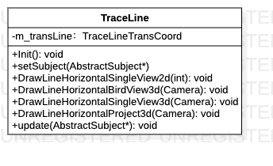

# TraceLine类

> 轨迹线绘制类

**类图**



## 代码解析

#### 初始化

```c++
void TraceLine::Init() {
    m_transLine.Init();
    InitParams();
    m_colors.push_back(Crimson);
    m_colors.push_back(Yellow);
    m_colors.push_back(SpringGreen);
    m_colors.push_back(Orange);
    m_colors.push_back(LightYellow);
    m_colors.push_back(Plum);
    m_colors.push_back(DarkKhaki);
    m_colors.push_back(LightPink);
    m_colors.push_back(Gold);
    m_nvGcontext = nvgCreateGLES2(NVG_ANTIALIAS | NVG_STENCIL_STROKES | NVG_DEBUG);
    LOGI("TraceLine init over");
}
```

#### 绘制2D单视图轨迹线

```c++
void TraceLine::DrawLineHorizontalSingleView2d(int camera_view) {
    auto view = static_cast<enum_camera_view >(camera_view);
    if(view == enum_camera_view::BACK || view == enum_camera_view::FRONT){
        m_camera_index = static_cast<TCameraIndex >(CameraViewToCamera(camera_view));
        m_screen_mode =  ScreenMode::HORIZONTAL;
        m_layout_mode = LayoutMode ::SINGLEVIEW;
        m_display_mode = DisplayMode ::Mode2D;
        m_transLine.SetTCameraIndex(m_camera_index);
        SetLayoutInfo(m_display_mode, m_screen_mode,  m_layout_mode);
        DrawLine2d();
    }
}
```

#### 绘制3D鸟瞰图轨迹线

```c++
void TraceLine::DrawLineHorizontalBirdView3d(Camera camera) {
    glm::mat4 view = camera.GetViewMatrix();
    camera.Zoom = 45.0f;
    glm::mat4 projection;
    projection = glm::perspective(glm::radians(camera.Zoom), m_transLine.m_view_size[0]/m_transLine.m_view_size[1], 0.1f, 100.0f);
    m_transform = projection * view;
    m_transLine.SetTransform(m_transform);
    m_screen_mode = ScreenMode::HORIZONTAL;
    m_layout_mode = LayoutMode::PANORAMA;
    m_display_mode = DisplayMode ::Mode3D;
    SetLayoutInfo(m_display_mode, m_screen_mode,  m_layout_mode);
    DrawVehicleContour(m_vehicle_contour_line_width);
    DrawLine3d();
}
```

#### 绘制3D单视图轨迹线

```c++
void TraceLine::DrawLineHorizontalSingleView3d(Camera camera) {
    glm::mat4 view = camera.GetViewMatrix();
    camera.Zoom = 45.0f;
    glm::mat4 projection;
    projection = glm::perspective(glm::radians(camera.Zoom), mPerspectRatio, 0.1f, 100.0f);
    m_transform =  projection * view;
    m_transLine.SetTransform(m_transform);
    m_screen_mode = ScreenMode::HORIZONTAL;
    m_layout_mode = LayoutMode::SINGLEVIEW;
    m_display_mode = DisplayMode ::Mode3D;
    SetLayoutInfo(m_display_mode, m_screen_mode,  m_layout_mode);
    DrawVehicleContour(m_vehicle_contour_line_width);
    DrawLine3d();
}
```

#### 绘制工程视图3D轨迹线

```c++
void TraceLine::DrawLineHorizontalProject3d(Camera camera) {
    glm::mat4 view = camera.GetViewMatrix();
    camera.Zoom = 45.0f;
    glm::mat4 projection;
    projection = glm::perspective(glm::radians(camera.Zoom), m_transLine.m_view_size[0]/m_transLine.m_view_size[1], 0.1f, 100.0f);
    m_transform = projection * view;
    m_transLine.SetTransform(m_transform);
    m_screen_mode = ScreenMode::HORIZONTAL;
    m_layout_mode = LayoutMode::SINGLEVIEW;
    m_display_mode = DisplayMode ::Mode3D;
    SetLayoutInfo(m_display_mode, m_screen_mode,  m_layout_mode);
    DrawVehicleContour( m_vehicle_contour_line_width);
    DrawTwoLine3d();
}
```

#### 数据更新

```c++
void update(AbstractSubject* subject) {
    m_blind_params = subject->getBlindZoneParams();
    mCarParams = subject->getCarParams();
    m_transLine.SetCarParams(subject->getCarParams());
    InitParams();
    mSideViewCameraIndex = subject->getSideViewCameraIndex();
    mDistortDisplayParams = subject->getDistortDisplayParams();
    m_transLine.SetDistortDisplayParams(subject->getSideViewCameraIndex(), subject->getDistortDisplayParams());
    mUnDistortDisplayParams = subject->getUnDistortDisplayParams();
    m_transLine.SetUndistortDisplayParams(subject->getSideViewCameraIndex(), subject->getUnDistortDisplayParams());
    mShowFrontLine = subject->isShowFrontLine();
    mShowBackLine = subject->isShowBackLine();
    mLineType = subject->getLineType();
    mCalibrated = subject->isCalibrated();
    SetSingleView2DMode(subject->isCalibrated());
    SetAngle(subject->getSteeringWheelValue());
    mGear = subject->getGear();
    m_gear = static_cast<Gear>(mGear);
    mBlackAreaRatio = subject->getBlackRatio();
}
```

