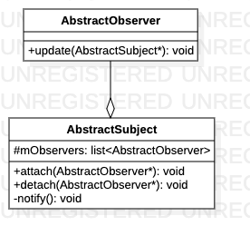

# 观察者模式

> 处理交互参数传递，组件模块继承AbstractObserver，StateManager继承AbstractSubject。当StateManager状态有变化时，调用notify函数通知相关组件，实现数据更新。

**关系图**



## 代码解析

#### 连接观察器

```c++
void AbstractSubject::attach(AbstractObserver *observer) {
    mObservers.push_front(observer);
}
```

#### 断开观察器

```c++
void AbstractSubject::detach(AbstractObserver *observer) {
    if (observer != nullptr) {
        mObservers.remove(observer);
    }
}
```

#### 通知更新

```c++
void AbstractSubject::notify() {
    for(auto observer : mObservers) {
        observer->update(this);
    }
}
```

