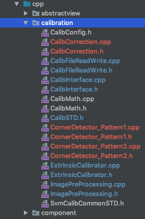

# 标定算法集成

**交接人**：陶佳伟

> 目前状况：与罗鹏集成了一种标定方案，该方案的手动标定效果可以接受，自动标定有待改善；后面需要和郑渊对接第二种标定方案。

#### 标定代码



> 这部分代码是标定部分源码，集成时不需要关心其算法的具体实现，只需要了解算法的接口文件**CalibInterface.h**、**CalibInterface.cpp**和**CalibConfig.h**。

##### CalibInterface.h

标定算法接口

```c++
public:
	void runCalibration(CalibConfig calibConfig);
	int getCalibrationState();
	void terminateCalibration();
	cv::Mat getCalibrationImage();
```

##### CalibConfig.h

标定配置接口

#### 标定控制代码

> 标定算法对Jni开放的接口被封在了**StateManager类**里面。

##### StateManager.h

```c++
void setCalibrationUserRequest(int request);//标定请求
void setCalibrationMode(int mode);//标定模式设置
void setCalibrationTagPattern(int pattern);
void setCalibrationLensType(const std::string &cameraType);
void setCalibrationMeasures(int ab, int bc, int ds);
void setCalibrationCornerPoints(std::vector<cv::Point2f> points);
void setAutoCalibrationImageFile(const std::string &back, const std::string &front, const std::string &left, const std::string &right);
int getCalibrationState();
```

 #### Jni标定算法接口

> native-lib.cpp文件为Jni接口文件

##### 标定请求

```c++
JNIEXPORT void JNICALL
Java_com_byd_aftermarketsvm_NativeLibrary_setCalibrationUserRequest(JNIEnv *env, jclass clazz, jint request) {
    // TODO: implement setCalibrationUserRequest()
    stateManager->setCalibrationUserRequest(request);
}
```

##### 设置标定模式

```c++
JNIEXPORT void JNICALL
Java_com_byd_aftermarketsvm_NativeLibrary_setCalibrationMode(JNIEnv *env, jclass clazz, jint mode) {
    // TODO: implement setCalibrationMode()
    stateManager->setCalibrationMode(mode);
}
```

##### 设置标定布样式

```c++
JNIEXPORT void JNICALL
Java_com_byd_aftermarketsvm_NativeLibrary_setCalibrationTagPattern(JNIEnv *env, jclass clazz, jint pattern) {
    // TODO: implement setCalibrationTagPattern()
    stateManager->setCalibrationTagPattern(pattern);
}
```

##### 设置相机类型

```c++
JNIEXPORT void JNICALL
Java_com_byd_aftermarketsvm_NativeLibrary_setCalibrationLensType(JNIEnv *env, jclass clazz, jstring camera_type) {
    // TODO: implement setCalibrationLensType()
    stateManager->setCalibrationLensType(env->GetStringUTFChars(camera_type, nullptr));
}
```

##### 设置标定测量参数

```c++
JNIEXPORT void JNICALL
Java_com_byd_aftermarketsvm_NativeLibrary_setCalibrationMeasures(JNIEnv *env, jclass clazz, jint ab, jint bc, jint ds) {
    // TODO: implement setCalibrationMeasures()
    stateManager->setCalibrationMeasures(ab, bc, ds);
}
```

##### 设置标定角点

```c++
JNIEXPORT void JNICALL
Java_com_byd_aftermarketsvm_NativeLibrary_setCalibrationCornerPoints(JNIEnv *env, jclass clazz, jfloatArray points) {
    // TODO: implement setCalibrationCornerPoints()
    jfloat *point = env->GetFloatArrayElements(points, nullptr);
    std::vector<cv::Point2f> pointVec;
    int length = env->GetArrayLength(points);
    for (int i = 0; i < length;) {
        //TODO: 数组转换
        pointVec.push_back(cv::Point2f(point[i], point[i + 1]));
        i += 2;
    }
    stateManager->setCalibrationCornerPoints(pointVec);
    delete point;
}
```

##### 设置自动标定图片

```c++
JNIEXPORT void JNICALL
Java_com_byd_aftermarketsvm_NativeLibrary_setAutoCalibrationImageFile(JNIEnv *env, jclass clazz, jstring back, jstring front, jstring left, jstring right) {
    // TODO: implement setAutoCalibrationImageFile()
    stateManager->setAutoCalibrationImageFile(env->GetStringUTFChars(back, nullptr), env->GetStringUTFChars(front, nullptr), env->GetStringUTFChars(left, nullptr), env->GetStringUTFChars(right, nullptr));
}
```

##### 获得标定状态

```c++
JNIEXPORT jint JNICALL
Java_com_byd_aftermarketsvm_NativeLibrary_getCaibrationState(JNIEnv *, jclass) {
    return stateManager->getCalibrationState();
}
```

